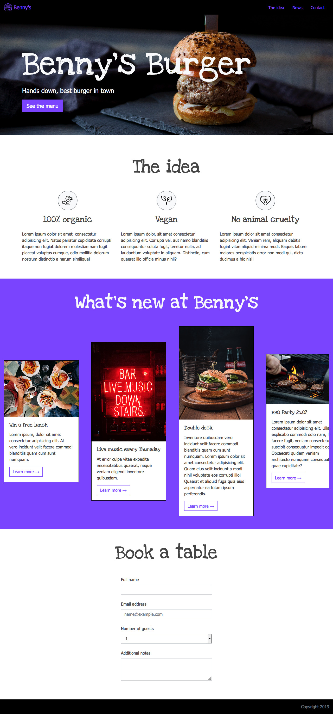

İşte talimatların Türkçe çevirisi:

# Benny's Burger

Haydi bir restoran sayfası oluşturmak için Bootstrap kullanalım!

Düzen için örnek resimlere göz at.

## Gereksinimler

### Stil ve Duyarlılık (Responsivity)
-   Sayfayı tasarlamak için `sass` kullan. `sass` zaten `devDependency` olarak yapılandırılmıştır (bkz. `package.json`). `src/scss/main.scss` dosyasında çalış.
-   `src/index.html` dosyasında çalış.
-   Projeye Bootstrap'i `npm` kullanarak ekle.
-   Projeyi duyarlı (responsive) hale getirmek için Bootstrap kullan.

### Navigasyon Çubuğu
-   Navigasyon çubuğunu oluşturmak için semantik olarak uygun HTML etiketini kullan.
-   Navigasyon çubuğu bir logo resmi ve navigasyon öğeleri için bir öğe listesi içermelidir.
-   Navigasyon çubuğu sayfa kaydırılırken ekranın üst kısmında görünmeye devam etmelidir.

### Banner
-   Başlığı "Benny's burger" olan banner bölümü `#banner` kimliğine sahip olmalıdır.
-   Banner elemanı, `./src/images/` klasöründen bir arka plan resmi içermelidir.
-   Banner bir `<h1>` başlığına sahip olmalı ve "[`Love Ya Like A Sister`](https://fonts.google.com/specimen/Love+Ya+Like+A+Sister)" yazı tipini kullanmalıdır.

### "The Idea" Bölümü
-   "The idea" bölümünün kapsayıcısı `#about-us` kimliğine sahip olmalıdır.
-   Kapsayıcı içinde, "[`Love Ya Like A Sister`](https://fonts.google.com/specimen/Love+Ya+Like+A+Sister)" yazı tipini kullanan bir `<h2>` başlığı oluştur.
-   İçeriği büyük ekranlarda (masaüstü) üç sütun halinde düzenlemek için Bootstrap kullan.

### "What's New" Bölümü
-   Bu bölümün kapsayıcısı `#team` kimliğine sahip olmalıdır.
-   Bölüm, "[`Love Ya Like A Sister`](https://fonts.google.com/specimen/Love+Ya+Like+A+Sister)" yazı tipini kullanan bir `<h2>` başlığı içermelidir.
-   Görsel ve metin içeren içerik öğelerini oluşturmak için Bootstrap'in Card bileşenini kullan.
-   Sayfadaki sütunları ortalamak için uygun Bootstrap sınıfını kullan.

### "Masa Rezervasyonu Yap" Bölümü
-   Kapsayıcı `#contact` kimliğine sahip olmalıdır.
-   Kapsayıcı, "[`Love Ya Like A Sister`](https://fonts.google.com/specimen/Love+Ya+Like+A+Sister)" yazı tipini kullanan bir `<h2>` başlığına sahip olmalıdır.

### Navigasyon Etkileşimi
-   Zaten bir `nav` elemanı içinde üç navigasyon öğesi ("Nav-Item") oluşturmuş bulunuyorsun. Bir navigasyon öğesine tıklandığında sayfa ilgili bölüme kaymalıdır. Örneğin, __Navigasyon çubuğunda 'Contact' öğesine tıklandığında, sayfa "Masa Rezervasyonu Yap" bölümüne kaydırılmalıdır__.

## Masaüstü

## Tablet

## Mobil

Not: Kendi değerlerini ayarlamak için hangi değişkenleri kullanman gerektiğini görmek için `node_modules/scss/bootstrap/_variables.scss` dosyasına göz at.